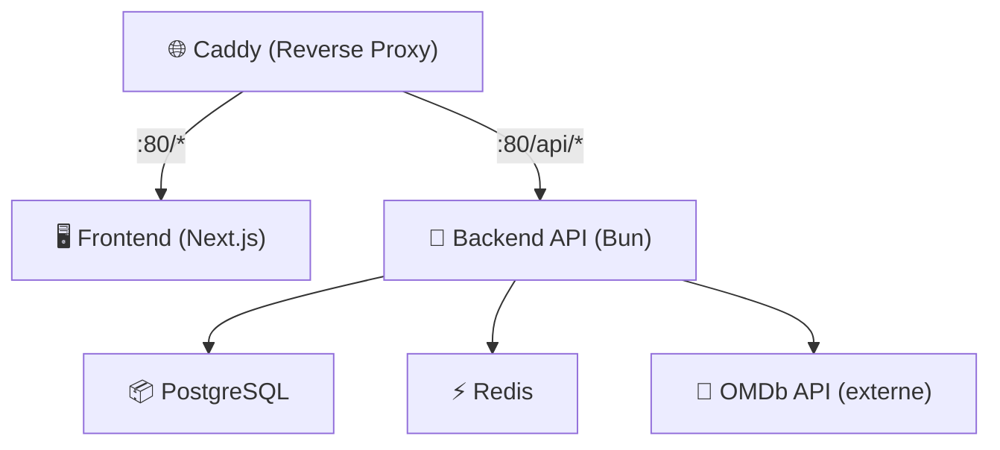
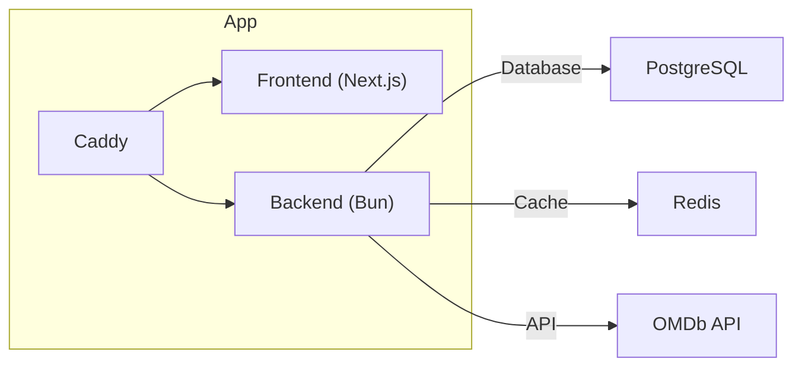

[](https://sonarqube.delpech.info/dashboard?id=UpjvIutAmiens_r4-b-8-virtu-2025_project_W_Abass_Hammed_7b5c0d02-fa79-4e68-9bbf-aba8d2f36cd7)

# 🎬 Film-o-mètre

> Une application web conteneurisée permettant d'afficher un film aléatoire et de le noter, conçue selon les bonnes pratiques de conteneurisation et CI/CD.

---

## 🚀 Objectif

Film-o-mètre permet à l’utilisateur de :

- Découvrir un film aléatoire (titre, affiche, description)
- Lui attribuer une note de 1 à 5
- Voir la note moyenne attribuée par les autres utilisateurs

---

## 🧱 Architecture



## 🐳 Stack Docker



## 📦 Structure du dépôt

```bash
.
├── docker/
│   ├── backend/               # Dockerfile du backend
│   ├── frontend/              # Dockerfile du frontend
│   ├── postgres/              # Init PostgreSQL (tconst_list.txt)
│   └── docker-compose.yml     # Stack complète
├── scripts/
│   └── download_tconst.sh     # Script pour mettre à jour les tconst
├── src/
│   ├── backend/               # Microservice backend (Bun)
│   └── frontend/              # Application frontend (Next.js)
└── .github/
    └── workflows/
        └── update-data.yml    # GitHub Action : Mise à jour automatique des données
        └── build.yml          # GitHub Action : SonarQube
```

## 🎁 Bonus Implémentés

- ✅ Intégration OMDb API (clé configurée via .env)

- ✅ PostgreSQL pour stockage persistant

- ✅ Redis pour cache des films notés

- ✅ Scripts de mise à jour automatique des données IMDb tconst

- ✅ CI/CD GitHub Action pour auto-commit des données

- ✅ Proxy inverse unique (port 80) via Caddy
