# 🎬 Film-o-mètre

[](https://sonarqube.delpech.info/dashboard?id=UpjvIutAmiens_r4-b-8-virtu-2025_project_W_Abass_Hammed_7b5c0d02-fa79-4e68-9bbf-aba8d2f36cd7)

> Une application web conteneurisée permettant d'afficher un film aléatoire et de le noter, conçue selon les bonnes pratiques de conteneurisation et CI/CD.

---

## 🚀 Objectif

Film-o-mètre permet à l’utilisateur de :

- Découvrir un film aléatoire (titre, affiche, description)
- Lui attribuer une note de 1 à 5
- Voir la note moyenne attribuée par les autres utilisateurs

---

## 🧱 Architecture

```mermaid
graph TD
    Caddy["🌐 Caddy (Reverse Proxy)"]
    Client["🖥️ Frontend (Next.js)"]
    Server["🧠 Backend API (Bun)"]
    PostgreSQL["📦 PostgreSQL"]
    Redis["⚡ Redis"]
    OMDb["🎥 OMDb API (externe)"]

    Caddy -->|:80/api/*| Server
    Caddy -->|:80/*| Client
    Server --> PostgreSQL
    Server --> Redis
    Server --> OMDb
```



## 🐳 Stack Docker


## 📦 Structure du dépôt

```bash
.
├── docker/
│   ├── backend/               # Dockerfile du backend
│   ├── frontend/              # Dockerfile du frontend
│   ├── postgres/              # Init PostgreSQL (tconst_list.txt)
│   └── docker-compose.yml     # Stack complète
├── scripts/
│   └── download_tconst.sh     # Script pour mettre à jour les tconst
├── src/
│   ├── backend/               # Microservice backend (Bun)
│   └── frontend/              # Application frontend (Next.js)
└── .github/
    └── workflows/
        └── update-data.yml    # GitHub Action : Mise à jour automatique des données
        └── build.yml          # GitHub Action : SonarQube
```

## 🎁 Bonus Implémentés

- ✅ Intégration OMDb API (clé configurée via .env)

- ✅ PostgreSQL pour stockage persistant

- ✅ Redis pour cache des films notés

- ✅ Scripts de mise à jour automatique des données IMDb tconst

- ✅ CI/CD GitHub Action pour auto-commit des données

- ✅ Proxy inverse unique (port 80) via Caddy

- ✅ Limitation des votes (localStorage)

- ✅ Classement des films les mieux notés

## 🧪 Endpoints Backend

- GET /api/v1/film → film aléatoire

- POST /api/v1/note → enregistrer une note

- GET /api/v1/note/:id → moyenne des notes

- GET /api/v1/top-rated → classement des films les mieux notés

## 🔄 Mise à jour automatique des tconst (IMDb)

Un script et une GitHub Action permettent de garder à jour les identifiants de films :

📄 `scripts/download_tconst.sh` :

- Télécharge les données IMDb
- Génére `docker/postgres/tconst_list.txt`

⚙️ `.github/workflows/update-data.yml`:

- Planifiée chaque semaine (cron)
- Commit automatique via `git-auto-commit-action`
